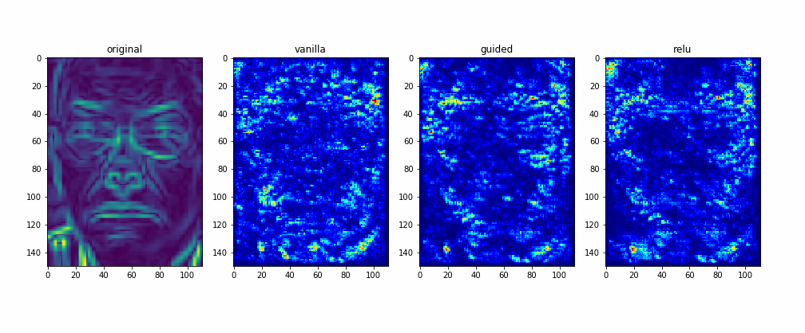

# Labeled Faced in the Wild
Image classification CNN model built with Keras Python library.

Used [opencv](https://opencv.org) for image preprocessing, and [Python Bayesian Optimization](https://github.com/fmfn/BayesianOptimization) for hyperparameter tuning.
Detailed explanation can be found in the [report](./report.pdf)
